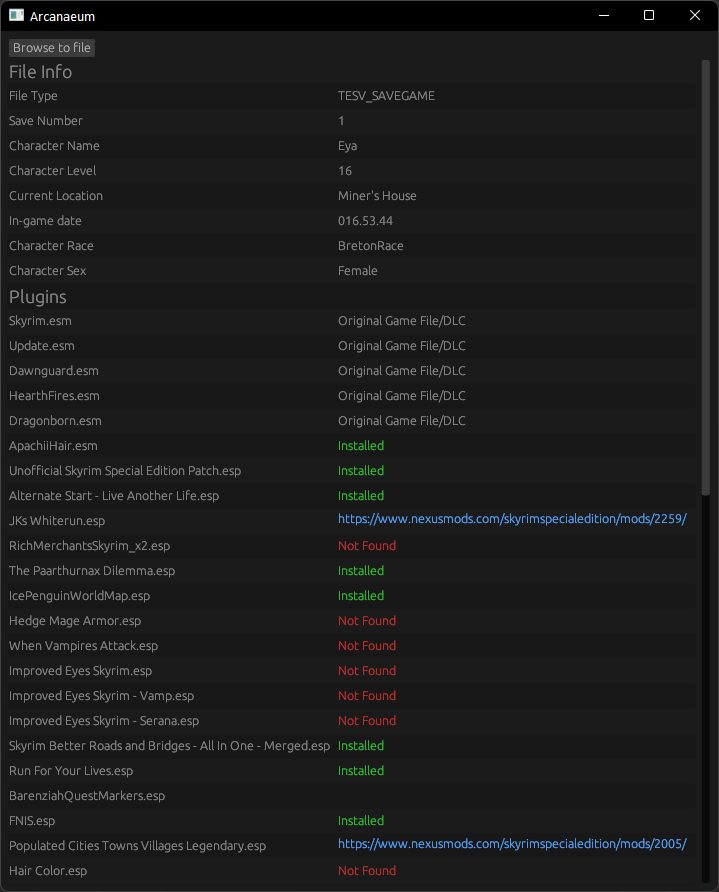

# Arcanaeum

Arcanaeum will analyse your Skyrim save games to determine which mods you used for that save.

**Currently only supports Skyrim Special Edition**

## Resources

## Info about the file format

https://en.uesp.net/wiki/Skyrim_Mod:Save_File_Format
https://en.uesp.net/wiki/Skyrim_Mod:File_Format_Conventions

### Info about matching plugins

https://www.nexusmods.com/news/13921

### List of skyrim mods can be found here

https://github.com/loot/skyrimse

## Future Plans

- Try an improve the underlying parser library or replace it with own implementation.
- Improve error handling when Vortex mod manager is not installed.

## Origin of the name

https://en.uesp.net/wiki/Skyrim:The_Arcanaeum
